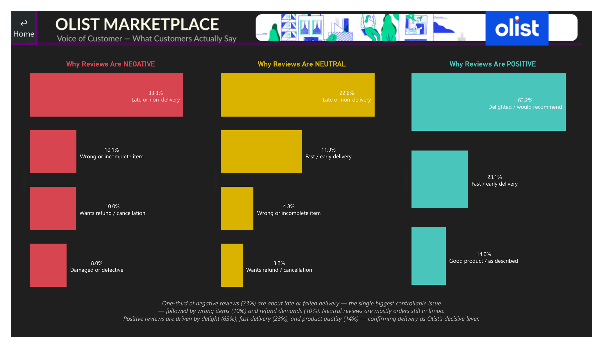

# Olist Marketplace Analytics

**End-to-end analysis of Brazil's largest e-commerce marketplace — advanced SQL → Portuguese sentiment NLP → executive Power BI dashboard.**


-2EA44F)

> One dataset, three layers: deep SQL business analysis on 99,441 orders, a Portuguese NLP sentiment + reason-classification layer on 42,370 free-text reviews, and a 9-page executive Power BI dashboard that ties operational quality directly to the voice of the customer. All revenue figures are in BRL.

---

## 🖼️ Dashboard Preview

**The headline finding the whole dashboard builds toward: delivery is Olist's single biggest controllable lever.** Late orders cost 1.72 stars, are 3× more likely to read negative in their written text, and account for one-third of all negative review reasons.

### Executive Overview


### Delivery & Operations — the 1.72★ penalty


### Voice of Customer — why reviews are negative, neutral, positive


> **All 9 pages** are in [`powerbi/screenshots/`](powerbi/screenshots/): Home · Executive Overview · Seller Performance & Risk · Customer Retention · Delivery & Operations · Sentiment Analysis · Sentiment Trends & Categories · Voice of Customer · Payments & Affordability.

---

## 📌 Business Context

Olist is Brazil's largest e-commerce marketplace — a platform connecting 3,095 sellers to customers across 27 states. As a Data Analyst, I used this public dataset to answer the questions a marketplace analytics team deals with every week: which sellers drive the most revenue and carry the most platform risk, whether Olist has a retention problem or an acquisition problem, how operational quality (delivery SLA) translates into review scores — and, going one layer deeper, *what customers are actually saying in their own words* and whether that text agrees with the star they clicked.

The dataset has embedded newlines in review text, Portuguese category names requiring translation joins, and NULL delivery timestamps for cancelled orders — the kind of data quality issues that don't exist in tutorial datasets but show up in every production database.

---

## ❓ Business Questions Answered

1. Which sellers dominate each product category — and what does the revenue gap between rank 1 and rank 3 signal?
2. Where does demand actually live — which cities and states drive order volume?
3. How did Olist grow from its first order to R$13.5M GMV, and what phases shaped that growth?
4. Is there a meaningful returning customer base, or is Olist structurally dependent on new acquisition?
5. What is the true cost of a late delivery — measured in review stars?
6. How do payment preferences and order values vary across income regions?
7. Where is order value concentrated — what does a typical Olist order actually look like?
8. Which sellers balance revenue, delivery quality, and customer satisfaction simultaneously?
9. **(NLP)** What do customers actually *say* — and where does written sentiment disagree with the star rating?
10. **(NLP)** *Why* are reviews positive, neutral, or negative — in concrete, actionable terms a business can act on (not just "happy" or "unhappy")?

---

## 🔑 Key Findings (TL;DR)

> Full write-up with query rationale in [`docs/business_case.md`](docs/business_case.md).

- **Olist has a retention problem, not an acquisition problem.** Month-1 retention is below 1% across every cohort — including the Black Friday 2017 cohort of 7,270 new customers (retained just 0.6%). Only 11 of 96,096 customers ordered in 3+ consecutive months.
- **Category concentration risk in `bed_bath_table`.** Top 2 sellers earn nearly 3× what rank 3 earns, giving those two sellers significant commission negotiation leverage over the platform.
- **Late delivery costs exactly 1.72 stars.** On-time orders average 4.29 ⭐; late orders average 2.57 ⭐. Olist's strategy of under-promising estimates (on-time orders arrive 13.7 days ahead of the promised date) is the reason their baseline rating is high.
- **Revenue peaked once and never recovered.** Black Friday 2017 hit R$1,003,862 (+52.1% MoM) — the only month above R$1M. The platform plateaued from April 2018 with near-zero growth.
- **Top 10% of orders generate 38% of revenue.** Median order is R$104 but the distribution has a R$13,664 tail — making average order value a misleading headline metric.
- **Geographic concentration risk.** 20 of the top 30 revenue sellers are in SP. One BA seller (rank 2) outperforms all SP sellers on quality.
- **The North/Northeast affordability signal.** Boleto (the payment method for the unbanked) peaks in AP (28.6%) and RR (28.3%) vs São Paulo's 18.8%. Customers in those poorer states also spread higher-value purchases across more monthly installments to stay affordable.
- **(NLP) Sentiment confirms the delivery story, and reveals what stars hide.** 50.4% of text reviews are positive, 19.6% negative. **435 reviews directly contradict their own star rating** — 328 five-star reviews read negative in text, 107 one-star reviews read positive — a dissatisfaction (and context) signal completely invisible to a star-only dashboard.
- **(NLP) One-third of negative reviews are a delivery problem — and it's the single biggest lever Olist has.** A custom rule-based, negation-aware reason classifier (built because raw keyword frequency surfaced generic emotion words like "terrible" with no business value) found: **33.3% of negative reviews are about late/non-delivery**, followed by wrong/incomplete items (10.1%) and refund requests (10.0%). Positive reviews are driven by delight (63.2%), fast delivery (23.1%), and product quality (14.0%).

**Scale:** 8 tables · 99,441 orders · ~530K rows · R$13.5M GMV · Sep 2016 – Sep 2018 · 42,370 NLP-scored reviews

---

## 💡 Recommendations

| Recommendation | Based On | Expected Action |
|---|---|---|
| Treat delivery speed as the #1 CX investment | 33.3% of negative reviews cite late delivery; late orders are 3× more likely to read negative | Prioritize logistics/SLA improvements over feature work |
| Stop investing in loyalty — maximise first-order margin | Sub-1% m1 retention across all cohorts | Reallocate retention budget to acquisition |
| Diversify `bed_bath_table` seller base | 2 sellers earning ~3× rank 3 | Onboard 2–3 new sellers to reduce negotiation risk |
| Fast-track exit for High Revenue Risk sellers | High revenue, sub-3.5★ rating sellers | Protect platform NPS before it shows in aggregate |
| Maintain deliberate delivery under-promise policy | On-time orders arrive 13.7 days ahead → 4.29★ | Do not tighten estimates — this is a zero-cost rating driver |
| Audit 5★-but-negative reviews manually | 328 reviews praise the score but complain in text | Likely an early-warning signal current QA misses entirely |

---

## 🛠️ Tools & Technologies

| Tool | Purpose |
|---|---|
| MySQL 8.0 | Data storage, all SQL analysis, and analytical views |
| Python — pandas, SQLAlchemy | Data loading (reviews CSV bypass) + reason classification |
| Python — pysentimiento, transformers, PyTorch (CPU) | Portuguese sentiment analysis on 42,370 review texts |
| Power BI Desktop | 9-page executive dashboard — star schema, DAX, custom design system, page navigation |
| Git + GitHub | Version control and portfolio |

---

## 📁 Project Structure

```
olist-marketplace-analytics/
│
├── sql/
│   ├── 01_setup/
│   │   ├── 01_create_tables.sql               ← schema + foreign keys for 8 tables
│   │   └── 02_load_data.sql                   ← bulk load 7 tables + notes on reviews
│   │
│   ├── 02_findings/
│   │   ├── top_sellers_by_category.sql         ← top-N sellers per category
│   │   ├── top_cities_by_state.sql             ← top-3 cities per state
│   │   ├── revenue_running_total.sql           ← rolling GMV + 7-day moving avg
│   │   ├── category_orders_running_total.sql   ← running total of orders per category
│   │   ├── monthly_revenue_growth.sql          ← month-over-month revenue growth (LAG)
│   │   ├── category_mom_order_growth.sql       ← month-over-month order count per category
│   │   ├── cohort_retention.sql                ← monthly cohort retention analysis
│   │   ├── customer_order_streaks.sql          ← longest consecutive ordering streaks
│   │   ├── sellers_above_state_avg_rating.sql  ← sellers outperforming state average
│   │   ├── delivery_sla_review_impact.sql      ← late delivery rate and review score impact
│   │   ├── payment_behaviour_by_state.sql      ← payment method and installment mix by state
│   │   ├── order_value_percentiles.sql         ← order value percentiles and revenue concentration
│   │   └── seller_scorecard.sql                ← capstone — seller revenue, quality and delivery
│   │
│   ├── 03_sentiment/
│   │   └── 01_create_review_sentiment.sql      ← review_sentiment table schema (idempotent)
│   │
│   └── 04_views/                               ← views powering the Power BI dashboard
│       ├── 01_cohort_retention_matrix.sql       ← cohort heatmap source
│       ├── 02_payments_by_state.sql             ← boleto/installments-by-state source
│       └── 03_review_reason_summary.sql         ← (doc) table generated by reason_analysis_v2.py
│
├── python/
│   ├── load_reviews.py                         ← pandas loader for order_reviews CSV
│   ├── sentiment_analysis.py                   ← Portuguese sentiment pipeline (batched, resumable)
│   ├── reason_analysis_v2.py                   ← negation-aware reason classifier (the "why")
│   └── requirements.txt                        ← pinned dependencies
│
├── powerbi/
│   ├── olist_marketplace_analytics.pbix        ← full 9-page dashboard
│   └── screenshots/                            ← PNG export of every page (this README's images)
│
├── docs/
│   ├── business_case.md                        ← findings + business interpretation
│   └── olist_data_model.svg                    ← star-schema diagram
│
└── data/                                       ← not tracked — download from Kaggle
```

---

## 📊 SQL Techniques Demonstrated

| Technique | Where it's used |
|---|---|
| `ROW_NUMBER()` with `PARTITION BY` | Top-N sellers per category; top cities per state |
| `LAG()` with `PARTITION BY` | MoM revenue growth; MoM order growth per category |
| `ROWS BETWEEN` window frames | Cumulative GMV; 7-day moving average |
| 5-stage CTE cohort logic | Monthly retention pivot — cohort → offset → active count → % |
| Gaps & Islands | Row_number subtraction to detect consecutive ordering streaks |
| `AVG() OVER PARTITION BY` | State-level seller benchmark comparisons |
| `NTILE(100)` and `NTILE(10)` | Order value percentiles and decile revenue share |
| Conditional aggregation pivot | Payment method mix across 27 states |
| Multi-CTE + `RANK()` + `CASE WHEN` | Capstone scorecard — 3 dimensions ranked simultaneously |
| `DATEDIFF` + NULL handling | Delivery SLA compliance — late vs on-time classification |
| Persisted analytical views | Cohort matrix + payments-by-state materialized as views feeding BI directly |

---

## 📈 Dataset

**Source:** [Brazilian E-Commerce Public Dataset — Olist](https://www.kaggle.com/datasets/olistbr/brazilian-ecommerce) (Kaggle) · **Database:** MySQL 8.0 · **Scale:** 8 relational tables, ~530K rows total

| Table | Rows | What it contains |
|---|---|---|
| orders | 99,441 | The spine — status + 5 timestamps from purchase to delivery |
| order_items | 112,650 | Line items — price, freight, which seller fulfilled it |
| order_payments | 103,886 | Payment type, installments, value |
| order_reviews | 99,224 | 1–5 scores + free-text comments |
| customers | 99,441 | City, state — no PII |
| products | 32,951 | Category, physical dimensions |
| sellers | 3,095 | City, state |
| category_translation | 71 | Portuguese to English category names |

---

## 🔧 Data Quality Notes

**1. The reviews CSV breaks bulk loading.** `LOAD DATA INFILE` fails because customer review text contains embedded newlines and imperfectly escaped quotes. MySQL's line parser trips on them. The fix is pandas — a proper CSV parser that handles multi-line quoted fields. The other 7 tables load fine via bulk load. See `python/load_reviews.py`.

**2. Category names loaded with trailing carriage return characters.** Windows CRLF line endings in `product_category_name_translation.csv` left carriage returns on every English category name — silently breaking every JOIN on that column with no error, just missing data. A single `UPDATE` with `REPLACE()` cleaned it.

**3. Duplicate `review_id` rows in the order-items join.** Joining reviews through `order_items` (a review can technically join to multiple line items) produced 437 duplicated divergence cases in early analysis; deduplicating on `review_id` in Power Query corrected this to the true figure of **435**.

**4. Percentage columns stored as raw ratios, not pre-multiplied values.** `payments_by_state.boleto_pct` stores `0.286`, not `28.6` — letting Power BI's native percentage format handle display everywhere automatically (cards, axes, tooltips) without per-visual formatting hacks.

---

## 🔍 Key Findings (detailed)

### Seller concentration by category

| Category | Rank 1 | Rank 2 | Rank 3 | Signal |
|---|---|---|---|---|
| watches_gifts | R$201K | R$192K | R$170K | Healthy — within 16% |
| health_beauty | R$79K | R$72K | R$66K | Healthy |
| bed_bath_table | R$165K | R$152K | R$55K | **Risk — ~3× gap to rank 3** |
| computers_accessories | R$53K | R$52K | R$47K | Healthy — very tight |
| sports_leisure | R$54K | R$42K | R$42K | Moderate |

### City concentration by state

| State | City #1 | Orders | City #2 | Orders | City #3 | Orders |
|---|---|---|---|---|---|---|
| SP | São Paulo | 15,540 | Campinas | 1,444 | Guarulhos | 1,189 |
| RJ | Rio de Janeiro | 6,882 | Niterói | 849 | Nova Iguaçu | 442 |
| MG | Belo Horizonte | 2,773 | Juiz de Fora | 427 | Contagem | 426 |
| BA | Salvador | 1,245 | Feira de Santana | 185 | Vitória da Conquista | 92 |
| DF | Brasília | 2,131 | Taguatinga | 4 | Guará | 2 |

### Olist GMV trajectory

| Milestone | Date | Value |
|---|---|---|
| First ever order | 2016-09-04 | R$72.89 |
| Platform inflection (single day) | 2016-10-04 | R$9,571 daily revenue |
| Black Friday peak (monthly) | 2017-11 | R$1,003,862 |
| Total GMV (end of dataset) | 2018-09-03 | R$13,496,408 |

### Customer retention — the one-time buyer problem

| Cohort | Acquired (m0) | Returned (m1) | m1 Retention |
|---|---|---|---|
| 2017-01 | 762 | 3 | 0.4% |
| 2017-05 | 3,571 | 17 | 0.5% |
| 2017-08 | 4,162 | 28 | 0.7% |
| 2017-11 (Black Friday) | 7,270 | 40 | 0.6% |
| 2018-01 | 6,992 | 23 | 0.3% |

**96.9%** of Olist's 96,096 customers never placed a second order. Only **252** placed 3+ orders, and just **11** in consecutive months.

### Delivery SLA — 1.72 star penalty per late order

| Status | Orders | % of Total | Avg Rating | Avg Days vs Estimate |
|---|---|---|---|---|
| On Time | 88,653 | 91.9% | 4.29 ⭐ | 13.7 days ahead of promise |
| Late | 7,700 | 8.1% | 2.57 ⭐ | 8.9 days past promise |

### Payment behaviour — regional affordability signal

| State | Boleto % | Credit Card % | Avg Installments | Avg Order Value |
|---|---|---|---|---|
| AP | 28.6% | 67.1% | 2.6 | R$232 |
| RR | 28.3% | 71.7% | 2.7 | R$219 |
| MA | 26.5% | 69.8% | 3.1 | R$199 |
| RS | 24.0% | 70.3% | 3.0 | R$157 |
| SP | 19.7% | 77.1% | 2.6 | R$137 |

### Order value distribution — median R$104, top 10% drive 38% of revenue

| Percentile | Order Value | Notes |
|---|---|---|
| 25th | R$61 | Bottom quarter |
| 50th (median) | R$104 | Typical order |
| 75th | R$175 | Upper half |
| 90th | R$297 | High-value threshold |
| Top 10% decile | R$307+ | Generates 38.1% of total revenue |
| Maximum | R$13,664 | 130× the median |

### Capstone — Seller scorecard: revenue vs quality vs delivery

| Revenue Rank | State | Revenue | Late % | Avg Rating | Segment |
|---|---|---|---|---|---|
| 1 | SP | R$229K | 11.6% | 4.13 ⭐ | Standard |
| 2 | BA | R$223K | 4.3% | 4.13 ⭐ | **Star Seller ✓** |
| 3 | SP | R$200K | 11.0% | 3.83 ⭐ | Standard |
| 4 | SP | R$194K | 10.2% | 4.34 ⭐ | Standard |
| 5 | SP | R$188K | 10.1% | 3.48 ⭐ | **High Revenue Risk ⚠** |

---

## 🧠 Sentiment Analysis (Portuguese NLP)

The reviews table holds 1–5 star scores **and** free-text comments in Brazilian Portuguese. The star tells you *how many* customers were happy; the text tells you *why* — and sometimes the two disagree.

**Model:** `pysentimiento/bertweet-pt-sentiment` — a RoBERTa trained natively on Brazilian Portuguese. It reads the review text independently of the star score. That independence is what makes the divergence finding meaningful: a star-predicting model would be circular.

**Pipeline** (`python/sentiment_analysis.py`): connects to MySQL via SQLAlchemy, filters to reviews with comment text, scores in batches with a live progress bar, writes to `review_sentiment` via an idempotent UPSERT — fully resumable if interrupted.

**Coverage:** 99,224 total reviews · 42,370 contain comment text (42.7%) · 56,854 score-only (excluded from text sentiment).

**Results:**

| Sentiment | Reviews | Share |
|---|---|---|
| Positive | 21,359 | 50.4% |
| Neutral | 12,723 | 30.0% |
| Negative | 8,288 | 19.6% |

**Divergence — sentiment vs star rating disagree on 435 reviews:**

| Case | Count | Why it matters |
|---|---|---|
| 5★ rating but **negative** text | 328 | Hidden dissatisfaction — customers who rate well but write complaints |
| 1★ rating but **positive** text | 107 | Context reviews — low score likely driven by delivery/seller, not the product itself |

**Caveats:** domain shift (model trained on tweets, not reviews); confidence score stored per review so low-certainty labels can be filtered downstream.

Schema: `sql/03_sentiment/01_create_review_sentiment.sql`

---

## 🗣️ Voice of Customer — Reason Classification (the "why" behind sentiment)

Sentiment alone answers "how many customers were unhappy" — it doesn't tell a business *what to fix*. An initial pass at word-frequency analysis surfaced only generic emotion words ("terrible", "loved it"), which carry no actionable signal. So I built a **rule-based, multi-label, negation-aware reason classifier** (`python/reason_analysis_v2.py`) that scans each review's Portuguese text for phrase patterns mapping to concrete business reasons: late/non-delivery, damaged item, wrong/incomplete item, poor quality, poor seller service, refund requests, fast delivery, good product, and general delight.

**Negation handling is the key accuracy fix.** A naive keyword match counts *"não recomendo"* ("I do NOT recommend") as praise because it contains "recomendo." The classifier checks the 3 words preceding any praise trigger for a negator (não/nem/nunca) and discards the match if negated — catching **326 negative reviews** that would have otherwise been miscounted as positive, and correcting positive-review "late delivery" false positives from 5,412 down to 454 (most of the remainder being genuine "arrived a bit late but I still loved it" mixed reviews, which is honest multi-label behaviour, not a bug).

**Top reasons per sentiment** (multi-label — a review can match more than one reason, so % can exceed the sentiment's total):

| Negative reviews (% of 8,309) | Neutral reviews (% of 12,416) | Positive reviews (% of 20,233) |
|---|---|---|
| Late or non-delivery — **33.3%** | Late or non-delivery — 22.6% | Delighted / would recommend — **63.2%** |
| Wrong or incomplete item — 10.1% | Fast / early delivery — 11.9% | Fast / early delivery — 23.1% |
| Wants refund / cancellation — 10.0% | Wrong or incomplete item — 4.8% | Good product / as described — 14.0% |
| Damaged or defective — 8.0% | Delighted / would recommend — 4.5% | |
| Poor quality / not as described — 6.0% | Wants refund / cancellation — 3.2% | |
| Poor seller service / communication — 2.3% | | |

**The thesis this confirms across the whole dashboard:** delivery shows up as the dominant driver in the SQL findings (1.72★ penalty), in raw sentiment (late orders 3× more likely to read negative), and now in the reason classification (one-third of all negative reviews cite late or failed delivery). Three independent analytical methods point at the same lever.

Output table: `review_reason_summary` (generated by the script, documented in `sql/04_views/03_review_reason_summary.sql`).

---

## 📊 Executive Power BI Dashboard

A 9-page executive report built on a star/galaxy schema (fact grain = order line items, conformed on `order_id`), Import mode, with a custom dark design system and page-to-page navigation (Home landing page with 8 nav cards; a return-to-Home icon on every page).

| Page | Headline insight |
|---|---|
| **Home** | Landing page · dataset summary · navigation to all 8 content pages |
| **Executive Overview** | KPI cards + GMV trajectory with Black Friday peak annotated on-chart |
| **Seller Performance & Risk** | 4-segment seller scorecard + `bed_bath_table` concentration risk + revenue-by-state map |
| **Customer Retention** | Sub-1% cohort retention heatmap, every month, every cohort |
| **Delivery & Operations** | The 1.72★ late-delivery penalty + 13.7-day deliberate under-promise insight |
| **Sentiment Analysis** | Sentiment vs star-rating divergence matrix (435 cases) + sentiment by delivery status |
| **Sentiment Trends & Categories** | Sentiment stability over time + sentiment breakdown across top 10 categories |
| **Voice of Customer** | The reason classifier — why reviews are negative / neutral / positive, in plain business language |
| **Payments & Affordability** | Boleto-usage map + order-value-vs-installments scatter — the North/Northeast affordability story |

**Technical challenges solved during the build** (good interview material):
- **Many-to-Many filter leakage** — the `fact_order_items ↔ fact_reviews` bridge and a Both-direction 1:1 relationship caused several measures to leak filters through unintended paths. Fixed via explicit `TREATAS()` joins on collected ID sets where DAX's relationship engine couldn't be trusted, and via **Edit Interactions** where even that wasn't sufficient.
- **Cross-filter contamination on a derived percentage measure** — clicking a category bar inflated a date-based sentiment trend measure past 100% because the filter context leaked past the `ALL()` modifiers applied at the wrong CALCULATE step. Resolved by moving complex aggregations into precomputed SQL views (`sentiment_trend_monthly`, `cohort_retention_matrix`, `payments_by_state`) instead of fighting the relationship model further — the right call when a DAX fix requires more debugging than the insight is worth.

Files: `powerbi/olist_marketplace_analytics.pbix` + `powerbi/screenshots/`.

---

## 🔁 Reproduce From Scratch

```powershell
# 1. Python dependencies
pip install torch --index-url https://download.pytorch.org/whl/cpu
pip install -r python/requirements.txt

# 2. Load the 8 Olist tables into MySQL
#    Run sql/01_setup/ in order, then python/load_reviews.py for the reviews table

# 3. Run the sentiment pipeline
$env:OLIST_DB_PASSWORD = "your_password"
python python/sentiment_analysis.py

# 4. Run the reason classifier (builds on the sentiment table)
python python/reason_analysis_v2.py

# 5. Create the analytical views (cohort + payments) from sql/04_views/

# 6. Open powerbi/olist_marketplace_analytics.pbix and refresh against your local MySQL
```

---

## 🚧 Project Status

| Phase | Status |
|---|---|
| Schema Design & Data Loading | ✅ Complete |
| Data Quality Investigation | ✅ Complete |
| Seller Performance Analysis | ✅ Complete |
| Customer Behaviour & Retention | ✅ Complete |
| Revenue & Operations Analysis | ✅ Complete |
| Capstone Seller Scorecard | ✅ Complete |
| Business Case Documentation | ✅ Complete |
| Portuguese Sentiment Analysis (NLP) | ✅ Complete |
| Negation-Aware Reason Classification (NLP) | ✅ Complete |
| Executive Power BI Dashboard (9 pages) | ✅ Complete |

---

**Brijesh Vaghela** · [LinkedIn](https://www.linkedin.com/in/brijesh-vaghela) · [GitHub](https://github.com/Brijesh403)
